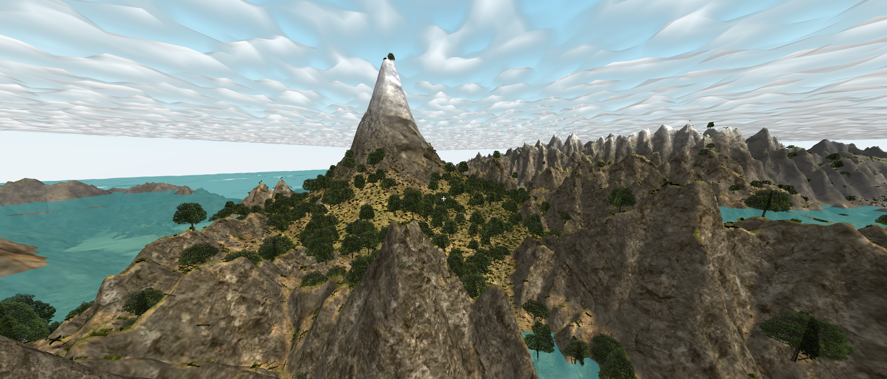

# Runtime MapGen

  

Fast, modular terrain deployment for WebGL/Three.js games using RogueEngine.
Instantly convert heightmap images into immersive, playable environments.

---

## Features

- **Massive Terrain Support**: Handles large heightmaps (e.g., 15,000×10,000).

- **Fast Load**: Renders a 3,000×3,000 terrain in under 3 seconds.

- **Auto-Texturing Shader**: Dynamic material blending with KTX2 support.

- **Level of Detail & Occlusion**: Two LOD tiers (High/Low) plus occlusion culling.

- **Foliage System**: Group-based foliage placement with per-group controls.

- **Local Collision**: Collision meshes around the camera.

- **Interactive Minimap**: Draggable minimap & full-screen view with coordinates.

- **Procedural Filters & Export**: Edit and export heightmaps at runtime.

---

## Installation

1. **Copy Assets**: Move the `Static` and `Assets` folders into your RogueEngine project directory (e.g., `RogueEngineProjects/YourGame/`).

2. **Add Prefab**: Drag `MapGen/RuntimeMapGen.roguePrefab` into your scene hierarchy.

3. **Play**: Press **Play** button!!!
- **Environment**: Add `MapGen/Environment/Environment.roguePrefab` for clouds and ocean.

- **Foliage**: Assign models from `MapGen/Foliage/` in the RuntimeMapGen component (assets by Quaternius).

---

## Dependencies

- **RogueEngine**: [https://rogueengine.io/](https://rogueengine.io/)

- **RapierPhysics**: Install via the RogueEngine in‑engine marketplace.
