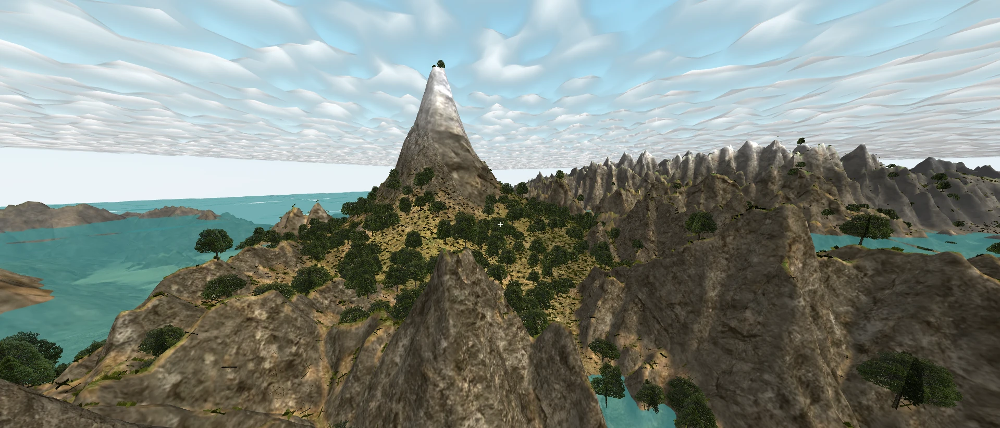
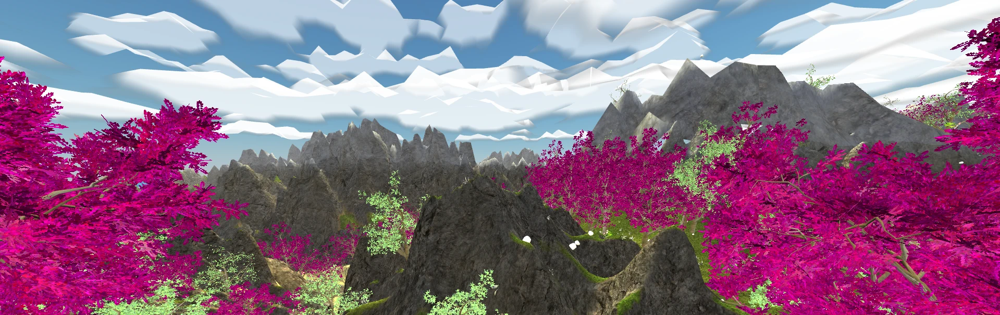
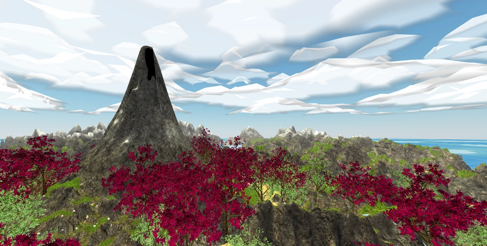

# Runtime MapGen  [Semi-maintaned]

  

Fast, modular terrain deployment for WebGL/Three.js games using RogueEngine.

For now it used as reference and starting point for better Terrain engines,
Its possible to use it for games, altho requires better chunking strategy

---

## Features

- **Massive Terrain Support**: Handles large heightmaps (e.g., 15,000×10,000).

- **Fast Load**: Renders a 3,000×3,000 terrain in under 3 seconds.

- **Auto-Texturing Shader**: Dynamic material blending with KTX2 support.

- **Level of Detail & Occlusion**: Two LOD tiers (High/Low) plus occlusion culling.

- **Foliage System**: Group-based foliage placement with per-group controls.

- **Local Collision**: Collision meshes around the camera.

- **Interactive Minimap**: Draggable minimap & full-screen view with coordinates.

- **Procedural Filters & Export**: Edit and export heightmaps at runtime.

---

## Installation

1. **Copy Assets**: Move the `Static` and `Assets` folders into your RogueEngine project directory (e.g., `RogueEngineProjects/YourGame/`)

2. **Add Prefab**: Drag `MapGen/RuntimeMapGen.prefab` into your scene hierarchy.

3. **Play**: Press **Play** button!!! (Toggle View_Mode to enable orbit-controls)
- **Environment**: Add prefab `MapGen/Environment/Environment.prefab` for clouds and ocean.

---

## Dependencies

- **RogueEngine**: [https://rogueengine.io/](https://rogueengine.io/)

- **RapierPhysics**: Install via the RogueEngine in‑engine marketplace.

---

## Where to get Maps

- I personally use [WorldMachine](https://www.world-machine.com/), very industry-based terrain-map generator (export as heigthmap)

- There's other software [Gaea](https://quadspinner.com/), similar to WorldMachine but newer and free.

- Earth heightmaps with good resolution: [Tangram Heightmapper](https://tangrams.github.io/heightmapper/)

  

  

