# Procedural Terrain Filters

Imported heightmaps can sometimes lack close-range detail, appearing flat and unrealistic. Procedural filters address this by simulating natural effects like erosion, ridges, valleys, and plateaus, or by adding custom fractal noise.

## Performance Considerations

- **Load Time:** Enabling filters increases the initial map loading time as geometry is generated upfront. However, once loaded, there should be no performance lag during runtime.
- **Exporting:** To mitigate slow load times in production, you can export the generated terrain to a new heightmap image using the dedicated export button. This process supports large dimensions (tested up to 15,000 x 10,000 pixels) and typically takes less than a minute.
- **Production Workflow:** Remember to disable all procedural filters in your final build after exporting the heightmap to avoid unnecessary load time increases.

## Workflow & Customization

- **Combining Filters:** Multiple filters can be active simultaneously to achieve complex results.
- **Iterating Filters:** Applying filters multiple times can create unique and interesting variations on the original heightmap. To do this:
  1. Apply the desired filter(s).
  2. Export the resulting terrain to a heightmap image.
  3. Import this new heightmap.
  4. Apply further filters as needed.

## Filter Render Priority

Filters are applied in the following order:

1. Fractal
2. Coastal Erosion
3. Ridges
4. Erosion
5. Plateaus
6. Valleys
7. Terracing
8. Cliff

## Utility Functions

- **[EXPORT] Terrain to Heightmap:** Exports the currently loaded terrain geometry into an image heightmap. The process is batched/tiled for efficiency and supports large-scale terrains.
- **[REFRESH] Regenerate Terrain:** Completely removes the current terrain from the scene and regenerates it based on the current settings. This is useful for quickly experimenting with different filter combinations.

---

# Fractal

Adds fractal noise for detail.

  

    <h6>Before</h6>
    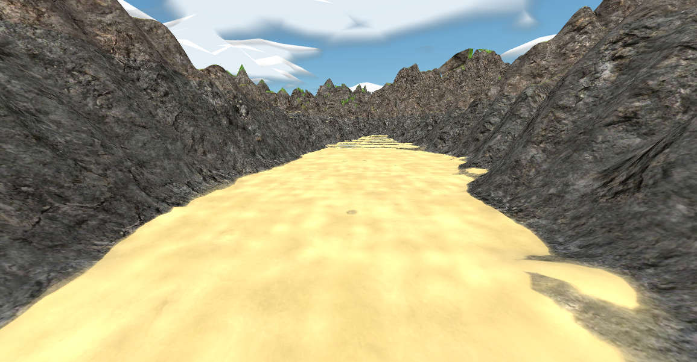
  

  

    <h6>After</h6>
    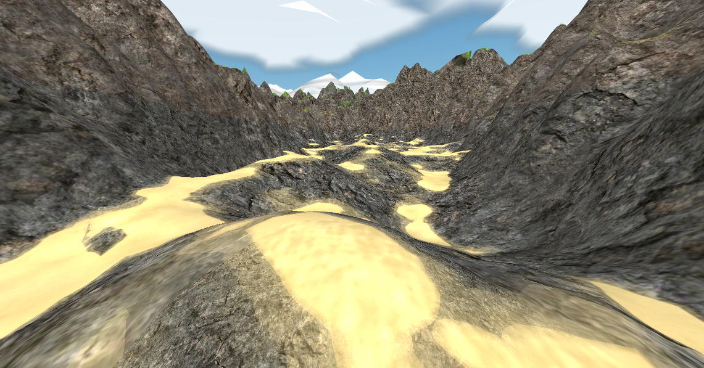
  

# Coastal Erosion

Simulates erosion effects typically found along coastlines.

  

    <h6>Before</h6>
    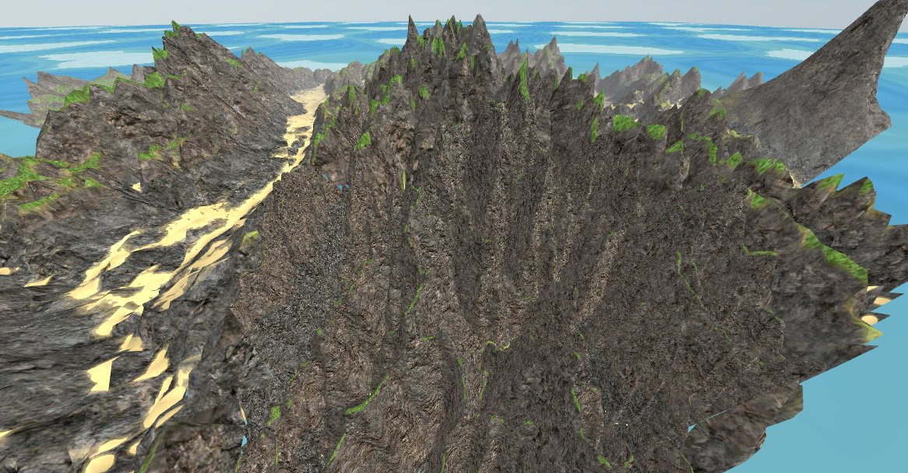
  

  

    <h6>After</h6>
    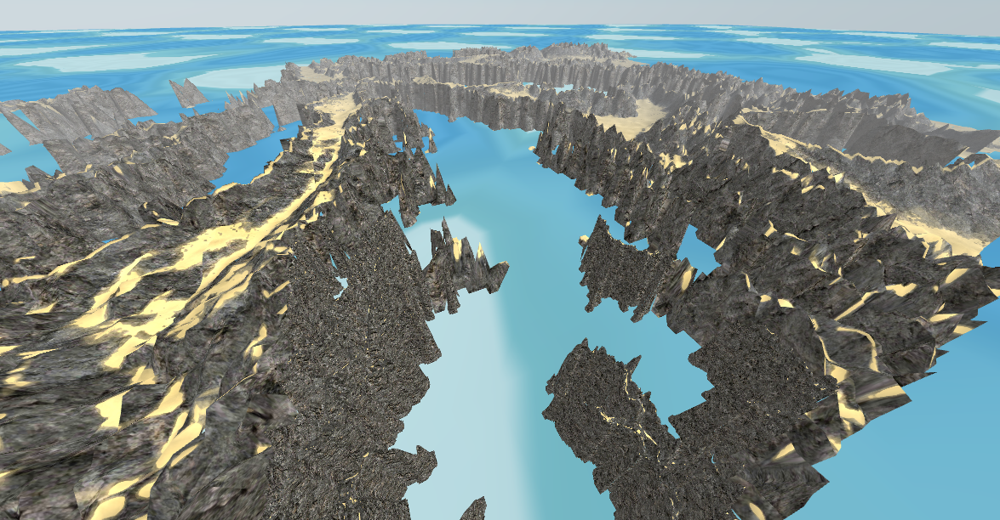
  

# Ridges

Creates ridges across the terrain.

  

    <h6>Before</h6>
    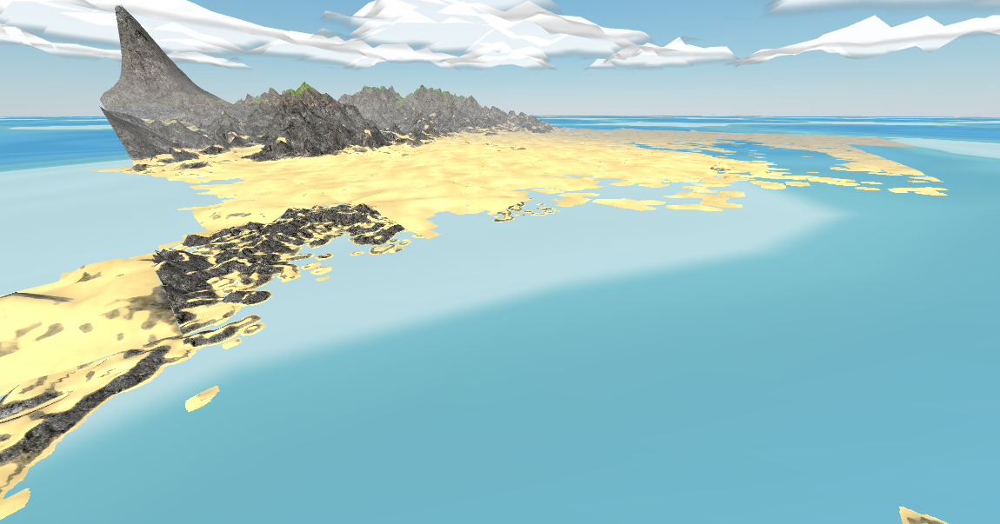
  

  

    <h6>After</h6>
    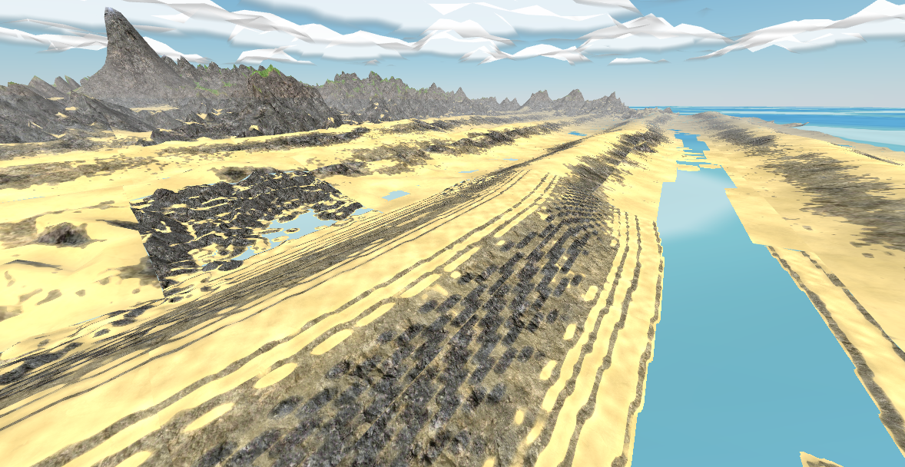
  

# Erosion

Smooths the terrain overall. Useful for blending results after multiple filter iterations.

  

    <h6>Before</h6>
    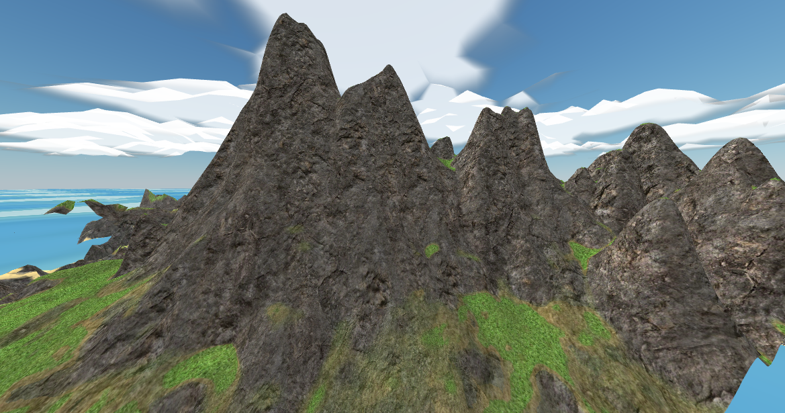
  

  

    <h6>After</h6>
    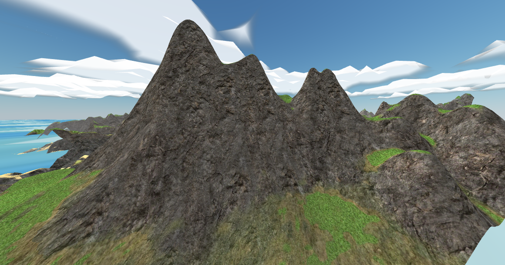
  

# Plateaus

Creates flat-topped elevated areas. Iterate a few times at different heights to create classic Caribbean-style terrain.

  

    <h6>Before</h6>
    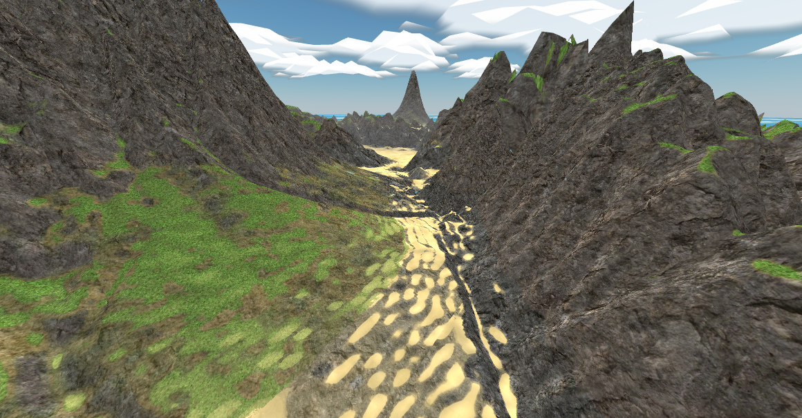
  

  

    <h6>After</h6>
    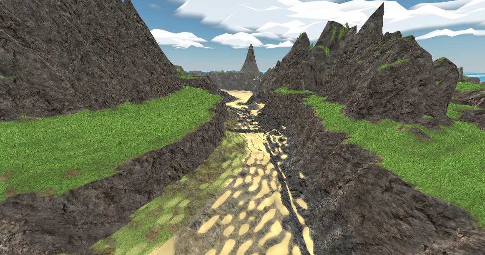
  

# Valleys

Carves valleys into the terrain.

  

    <h6>Before</h6>
    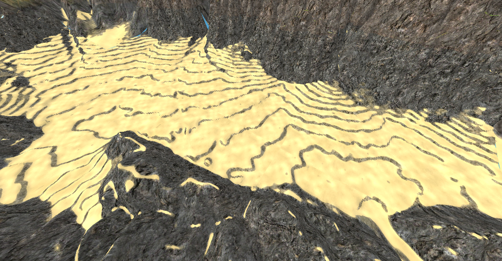
  

  

    <h6>After</h6>
    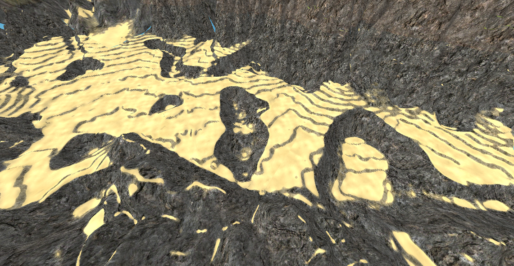
  

# Terracing

Creates step-like terraces, similar to mesas.

  

    <h6>Before</h6>
    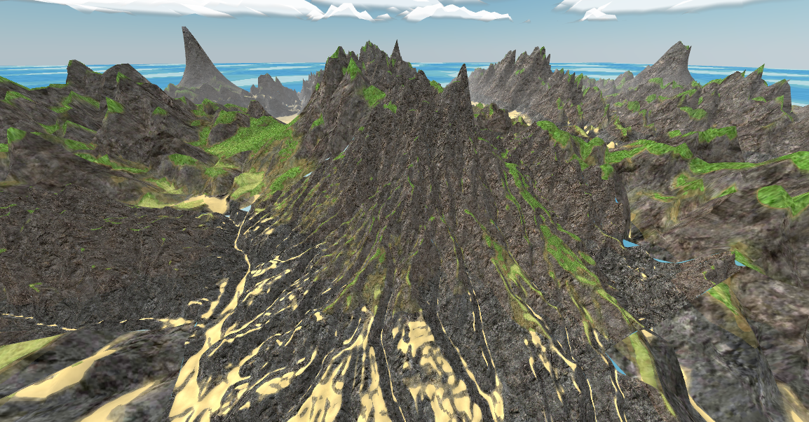
  

  

    <h6>After</h6>
    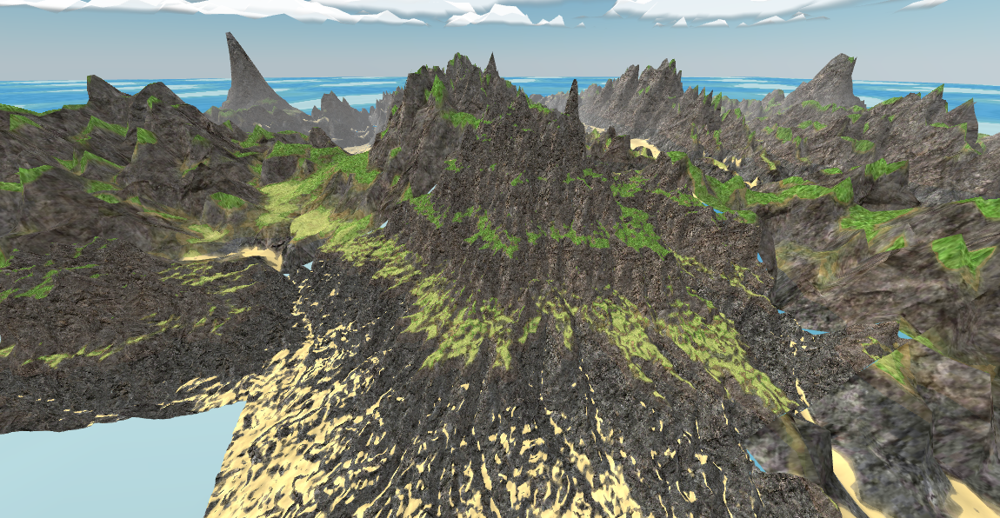
  

# Cliff

Generates steep cliff faces.

  

    <h6>Before</h6>
    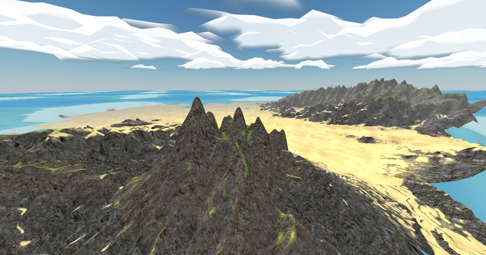
  

  

    <h6>After</h6>
    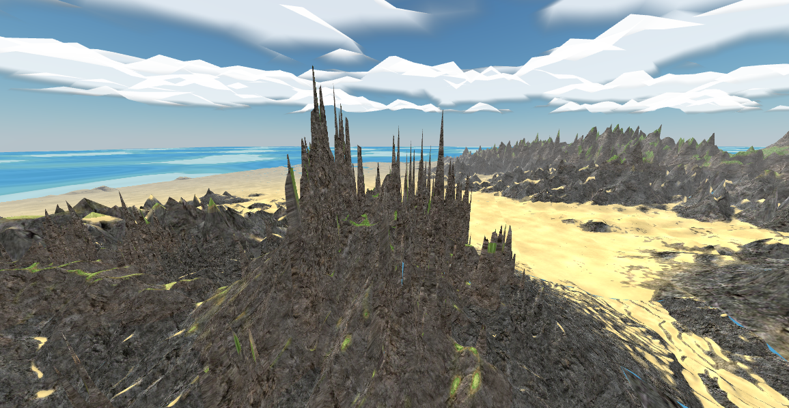
  

